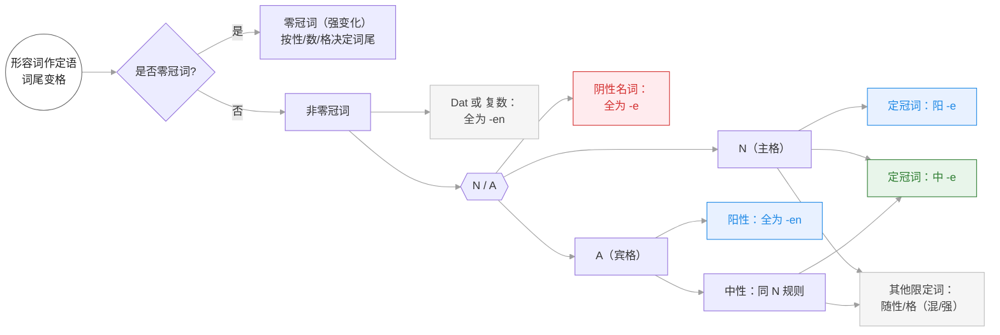

<!-- source: https://www.notion.so/Adjektivdeklination-166f21c3ea5380e59527fdf9629029f5 -->

# Adjektivdeklination 形容词变格

### 在不定冠词和物主代词后的变格

 | der | das | die | die(Pl.)
--- | --- | --- | --- | ---
Nominativ | ein neu<u>er</u> Hut | ein neu<u>es</u> Kleid | eine neu<u>e</u> Hose | die neu<u>en</u> Hüte
Akkusativ | einen neu<u>en</u> Hut | ein neu<u>es</u> Kleid | eine neu<u>e</u> Hose | die neu<u>en</u> Hüte
Dativ | einem neu<u>en</u> Hut | einem neu<u>en</u> Kleid | einer neu<u>en</u> Hose | die neu<u>en</u> Hüte

### 在定冠词后的变格

 | der | das | die | die(Pl.)
--- | --- | --- | --- | ---
Nominativ | der neu<u>e</u> Hut | das neu<u>e</u> Kleid | die neu<u>e</u> Hose | die neu<u>en</u> Hüte
Akkusativ | den neu<u>en</u> Hut | das neu<u>e</u> Kleid | die neu<u>e</u> Hose | die neu<u>en</u> Hüte
Dativ | dem neu<u>en</u> Hut | dem neu<u>en</u> Kleid | der neu<u>en</u> Hose | die neu<u>en</u> Hüte

### 在零冠词后的变格

 | der | das | die | die(Pl.)
--- | --- | --- | --- | ---
Nominativ | grün<u>er</u> Tee | warm<u>es</u> Wasser | kalt<u>e</u> Milch | hoh<u>e</u> Preise
Akkusativ | grün<u>en</u> Tee | warm<u>es</u> Wasser | kalt<u>e</u> Milch | hoh<u>e</u> Preise
Dativ | grünem Tee | warm<u>em</u> Wasser | kalt<u>er</u> Milch | hoh<u>en</u> Preise

